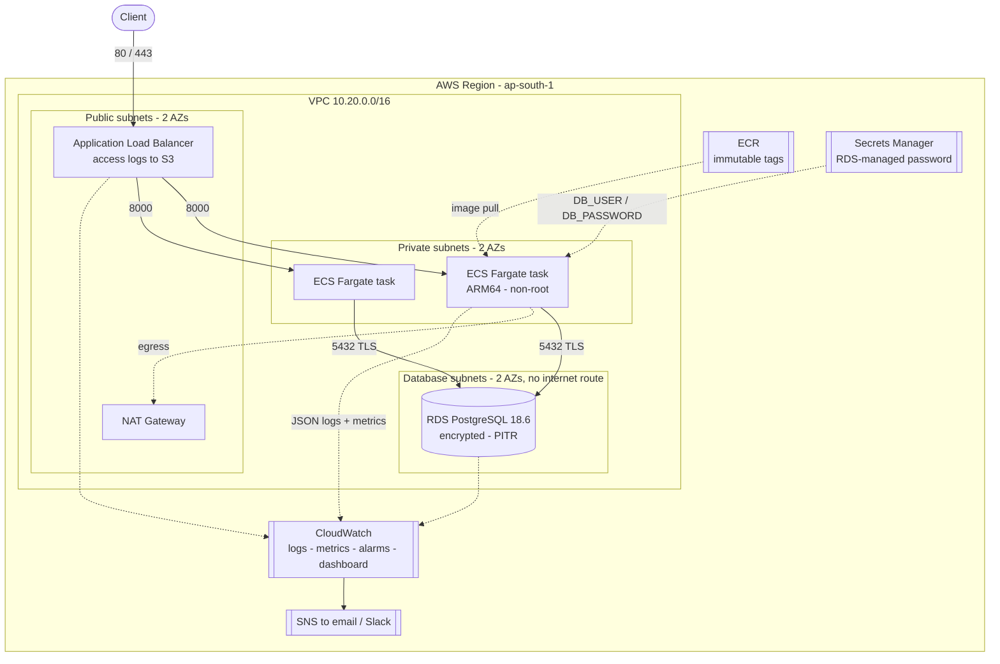

# Meridian Platform

Infrastructure, delivery pipeline and observability for a containerised service
on AWS.

A three-tier VPC with ECS Fargate and RDS PostgreSQL, defined in Terraform;
a GitHub Actions pipeline that tests, scans, deploys to staging and requires a
human approval before production; and monitoring split between Prometheus/Grafana
for application signals and CloudWatch for the managed services.

The `meridian-api` service itself is small on purpose. The domain is a narrow
item catalogue; what it is built to demonstrate is *operability* — separate
liveness and readiness signals, RED metrics on every request, structured logs,
and a build identifier the pipeline asserts on after every deploy.

---

## Layout

```
services/api/                   FastAPI service — /health, /readyz, /metrics, CRUD
infrastructure/terraform/
  bootstrap/                    One-time S3 state backend
  modules/                      network · data · compute · observability
  environments/                 staging · prod — composition and values only
platform/observability/         Prometheus, alert rules, Grafana dashboards
scripts/                        Repository-level checks used by make and CI
docs/
  adr/                          Architecture decision records
  architecture.md               Diagrams, request path, trade-offs
  engineering-log.md            Problems hit while building, and the fixes
  runbooks/recovery.md          Restore procedures
.github/workflows/              ci · terraform · cd
.github/actions/deploy-ecs/     Shared deploy, verify and rollback action
Makefile                        Every check CI runs, runnable locally
```

Terraform modules are split by **lifecycle**, not by resource type: `network`
changes almost never, `data` changes in a maintenance window, `compute` changes
on every deploy, `observability` changes whenever a threshold turns out to be
wrong. The dependency graph runs one way only:
`network → data → compute → observability`.

---

## Architecture



Request path, security-group chain and deployment sequence:
[docs/architecture.md](docs/architecture.md).
Why each choice was made: [docs/adr/](docs/adr/README.md).

---

## Getting started

### Run the whole stack locally

No AWS account required.

```bash
make up
```

| Service | URL |
|---|---|
| API | <http://localhost:8000/docs> |
| Metrics | <http://localhost:8000/metrics> |
| Prometheus | <http://localhost:9090> |
| Grafana | <http://localhost:3000> (anonymous viewer, or admin / admin) |

Both dashboards are provisioned automatically under the **Meridian** folder.
`make load` drives enough traffic through the API to populate them, including a
deliberate slow request and a deliberate error so the latency and error-rate
panels have something to show.

### Run the checks

```bash
make install     # virtualenv and dev dependencies
make verify      # lint, tests, dependency audit, terraform, promtool, dashboards
```

`make verify` runs every check CI runs that does not need AWS credentials.
`make help` lists the rest.

Integration tests skip cleanly when no PostgreSQL is reachable; `make db-up`
starts one. In CI they are not permitted to skip — the pipeline fails the build
if they do, because a broken service container would otherwise produce a green
result.

### Provision an environment

Full step-by-step, including teardown and its sharp edges:
**[docs/runbooks/provisioning.md](docs/runbooks/provisioning.md)**. The short
version follows.

```bash
# One-time, per account: create the state bucket.
terraform -chdir=infrastructure/terraform/bootstrap init
terraform -chdir=infrastructure/terraform/bootstrap apply \
  -var "state_bucket_name=meridian-tfstate-<account-id>"
```

That configuration keeps local state deliberately: it creates the bucket every
other configuration then uses as its backend.

```bash
cd infrastructure/terraform/environments/staging
cp backend.hcl.example backend.hcl        # fill in the bucket name
terraform init -backend-config=backend.hcl
terraform plan
terraform apply
```

Production is identical under `environments/prod`. Both call the same modules;
every difference between them is a variable value with a comment saying what it
buys.

---

## Delivery pipeline

```
pull request  ──▶ ci.yml         lint · unit · integration · pip-audit
                                 Trivy fs · build · Trivy image · smoke · actionlint
              ──▶ terraform.yml  fmt · validate (staging + prod) · tflint · Checkov · plan

merge to main ──▶ cd.yml         build (ARM64) ─▶ scan ─▶ push to ECR
                                 ─▶ deploy staging ─▶ wait stable ─▶ verify version
                                 ─▶ [ MANUAL APPROVAL ]
                                 ─▶ deploy production ─▶ wait stable ─▶ verify
                                 ─▶ roll back on failure ─▶ notify
```

Four properties worth naming:

- **The approval gate is a GitHub Environment protection rule**, not a step in
  the workflow file. A rule held in repository settings cannot be removed by the
  same pull request that wants to bypass it.
- **The image is built once.** Production deploys the exact artefact that ran in
  staging. A rebuild is a different artefact however identical the inputs look.
- **Scanning happens before the push**, so a vulnerable image never reaches the
  registry and cannot be deployed by someone pulling "the latest build".
- **Verification asserts the deployed version**, not just that the rollout
  finished. The post-deploy step polls `/health` until it reports the commit SHA
  that was just shipped. "The rollout completed" and "the new code is serving
  traffic" are different claims.

### Repository configuration

**Settings → Environments**: create `staging`, `staging-plan` and `production`.
Add at least one **required reviewer** to `production` — that setting *is* the
manual gate.

**Settings → Secrets and variables → Actions → Variables:**

| Variable | Example |
|---|---|
| `AWS_DEPLOY_ROLE_ARN` | `arn:aws:iam::123456789012:role/github-actions-deploy` |
| `AWS_PLAN_ROLE_ARN` | `arn:aws:iam::123456789012:role/github-actions-plan` (read-only) |
| `TF_STATE_BUCKET` | `meridian-tfstate-123456789012` |
| `ECR_REPOSITORY` | `meridian-api-staging` |
| `STAGING_ECS_CLUSTER` / `_SERVICE` / `_TASK_FAMILY` | from `make tf-output` |
| `PRODUCTION_ECS_CLUSTER` / `_SERVICE` / `_TASK_FAMILY` | from `make tf-output` |
| `STAGING_URL`, `PRODUCTION_URL` | `http://<alb-dns-name>` |

**Secrets:** `SLACK_WEBHOOK_URL` — optional; notification steps skip silently
when it is absent.

Authentication to AWS is via GitHub OIDC. There are no long-lived AWS access
keys in this repository. If `AWS_PLAN_ROLE_ARN` is unset the plan job is skipped
and the rest of the gate still runs in full, so the repository is reviewable
without an AWS account.

---

## Monitoring and logging

Three dashboards, split by what each tool can actually see.

| Dashboard | Tool | Covers |
|---|---|---|
| **Service (RED)** | Grafana | Request rate by endpoint and status, 4xx/5xx ratio, p50/p95/p99 latency, in-flight requests, slowest endpoints |
| **Infrastructure & Database** | Grafana | Container CPU and memory, PostgreSQL connections against `max_connections`, transactions/s, buffer cache hit ratio, scrape health |
| **Platform overview** | CloudWatch | ALB request rate, 5xx, p99 and target health; ECS CPU, memory, task counts, ephemeral storage; RDS CPU, connections, free storage, IOPS and latency; plus a live Logs Insights error table |

Dashboards are JSON in version control, provisioned on startup with
`allowUiUpdates: false`. A dashboard assembled in a browser cannot be rebuilt
after someone deletes it. `scripts/check_dashboards.py` parses every PromQL
expression with `promtool` in CI, because Grafana renders an invalid query as an
empty panel — indistinguishable from "no traffic", which is exactly when someone
is looking at it.

**Logs.** The service emits one JSON object per line. That is what lets the
CloudWatch metric filter be a structured pattern (`{ $.level = "ERROR" }`)
rather than a substring match that would also fire on the word ERROR inside
user-supplied text.

| Log type | Destination |
|---|---|
| Application | CloudWatch `/ecs/meridian-api-<env>/app`, via the `awslogs` driver |
| ECS Exec sessions | CloudWatch `/ecs/meridian-api-<env>/exec` |
| ALB access logs | S3, transitioned to Infrequent Access at 30 days |
| VPC flow logs (REJECT only) | CloudWatch |
| PostgreSQL and upgrade logs | CloudWatch, exported by RDS |

Flow logs capture REJECT only. ACCEPT traffic for a healthy service is
high-volume, expensive to store, and already described by the ALB access logs;
rejected traffic is the part that indicates a misconfiguration or a probe.

**Alerting.** Five Prometheus rules (`TargetDown`, `HighErrorRate`,
`HighLatencyP99`, `PostgresDown`, `PostgresConnectionsNearLimit`) and twelve
CloudWatch alarms, all fanned out through a single SNS topic to email and Slack.
Thresholds are variables and deliberately looser in staging: an alert that fires
constantly in staging trains everyone to ignore the production alarm that shares
its name.

---

## Security

| Control | Where |
|---|---|
| Database unreachable from the internet | Database subnets have no IGW or NAT route ([ADR 0002](docs/adr/0002-network-segmentation.md)) |
| No public task IPs | `assign_public_ip = false` |
| Security groups reference groups, never CIDRs | ALB SG → task SG → RDS SG |
| Database rejects plaintext connections | `rds.force_ssl = 1`; the service connects with `sslmode=require` |
| Encryption at rest | RDS, ECR, all S3 buckets, Terraform state |
| TLS enforced on buckets | `aws:SecureTransport` deny policy |
| No credential in Terraform state | RDS-managed password ([ADR 0004](docs/adr/0004-database-credentials.md)) |
| No long-lived AWS keys in CI | GitHub OIDC role assumption |
| Least-privilege task role | Grants ECS Exec only; database access is a password, not IAM |
| Scoped secret read | Execution role can read exactly one secret ARN |
| Confused-deputy guard | `aws:SourceAccount` / `aws:SourceArn` on the ECS trust policy |
| Non-root container | `USER 10001`, `readonlyRootFilesystem = true` |
| Base image pinned by digest | Not by tag ([ADR 0008](docs/adr/0008-supply-chain-pinning.md)) |
| Every Action pinned to a commit SHA | Same ADR |
| Dependency and image scanning | `pip-audit`, Trivy filesystem and image, blocking on HIGH/CRITICAL |
| Infrastructure scanning | Checkov and tflint on every infrastructure change |
| Script-injection hardening | Untrusted values reach shell steps via `env:` and `jq`, never `${{ }}` |
| Audited production shells | ECS Exec sessions logged to CloudWatch |
| Immutable image tags | ECR `IMMUTABLE`; deploys reference `sha-<commit>` |

**Known gap:** environments without a registered domain have no ACM certificate
and therefore no HTTPS listener. Set `certificate_arn` and port 80 becomes a 301
to a TLS 1.3 listener. Reasoning and the accepted cost:
[ADR 0007](docs/adr/0007-tls-termination.md).

### Secret management

1. **Database credentials** — generated, stored and rotated by RDS in Secrets
   Manager. Never passes through Terraform. The task definition references
   individual JSON keys (`<secret-arn>:password::`), so the container receives
   only the field it needs.
2. **CI to AWS** — GitHub OIDC, short-lived tokens, no stored access keys.
3. **Slack webhook** — a repository secret, supplied as
   `TF_VAR_slack_webhook_url` and marked `sensitive`. Never in a tfvars file.
4. **Terraform state** — encrypted, versioned, TLS-only, public access blocked.

---

## Backup and recovery

| What | Mechanism | Recovery |
|---|---|---|
| Database | Automated backups — 7 days staging, 30 production — with point-in-time recovery | `restore-db-instance-to-point-in-time` |
| Database, on teardown | `skip_final_snapshot = false` plus deletion protection in production | Restore from the final snapshot |
| Terraform state | S3 versioning, 90-day non-current retention | Restore the previous object version |
| Container images | ECR, ten most recent releases retained | Redeploy any prior `sha-` tag via `workflow_dispatch` |
| Application configuration | Version control | `git revert` and redeploy |

Procedures: [docs/runbooks/recovery.md](docs/runbooks/recovery.md).

---

## Cost

Approximate monthly figures for `ap-south-1`, staging running continuously.

| Lever | Where | Effect |
|---|---|---|
| Single shared NAT gateway in staging | `single_nat_gateway = true` | ~32 USD/mo per AZ avoided |
| Fargate Spot for all of staging | `fargate_spot_weight = 1` | ~70% off compute |
| Graviton throughout | `cpu_architecture = ARM64`, `db.t4g.*` | ~20% off compute and RDS |
| Single-AZ database in staging | `multi_az = false` | Halves the instance cost |
| Enhanced Monitoring off in staging | `monitoring_interval = 0` | Removes a per-instance charge |
| Shorter log retention in staging | 14 days against 90 | Logs are the second-largest line item after compute |
| ECR lifecycle policy | Untagged expire at 7 days, 10 releases kept | Bounds registry growth |
| S3 lifecycle on access logs | IA at 30 days, expiry at 30/365 | Bounds log storage |
| Autoscaling floor of 1 in staging | `min_capacity = 1` | Pays for idle once, not twice |
| VPC endpoints **off** in staging | `enable_vpc_endpoints = false` | See below |

**On VPC endpoints.** They are routinely presented as a saving. They are not,
unconditionally. Four interface endpoints across two availability zones cost
roughly **60 USD/month** in hourly charges before any data moves. NAT data
processing is about 0.045 USD/GB, so the break-even sits near **1.3 TB/month of
egress**. Staging is nowhere near that and leaves them off; production enables
them and gains the private path as well as the saving. The S3 *gateway* endpoint
is free and always enabled, because ECR stores image layers in S3 and without it
every image pull is billed as NAT traffic.

Staging totals roughly **70–90 USD/month**, of which the largest single item is
the NAT gateway rather than the compute. `make tf-apply ENV=staging` and
`terraform destroy` bracket that cost when the environment is not needed.

---

## Roadmap

Deliberately out of scope today, in rough order of value. Reasoning for the
first three is in the linked decision records.

1. **Alembic migrations** as a one-off ECS task ahead of the service update
   ([ADR 0006](docs/adr/0006-schema-management.md) — this has a hard deadline).
2. **Automated dependency updates** (Dependabot or Renovate). Pinning without
   automation trades a supply-chain risk for a patching risk
   ([ADR 0008](docs/adr/0008-supply-chain-pinning.md)).
3. **HTTPS by default**, once a domain exists
   ([ADR 0007](docs/adr/0007-tls-termination.md)).
4. **Blue/green deployments** via CodeDeploy with canary traffic shifting.
   Rollback today is reactive: it happens after a failure.
5. **AWS WAF** on the load balancer — managed rule groups and rate limiting.
6. **OpenTelemetry tracing** to X-Ray. Metrics show *that* p99 moved; traces
   show which query moved it.
7. **Atlantis or Terraform Cloud**, so `apply` runs from a pull request rather
   than from a laptop.
8. **Multi-region disaster recovery** — cross-region snapshot copies and ECR
   replication.
9. **Tighter task egress** — VPC endpoints and prefix lists instead of
   `0.0.0.0/0`.
10. **Terratest** over the modules, and load testing in the pipeline so the
    scaling policy is tuned against measurements rather than estimates.

---

## Verification

Every check below runs locally with no cloud credentials, via `make verify`.

Everything below was run against a real AWS account and a real GitHub runner,
not only validated locally.

| Check | Tool | Result |
|---|---|---|
| Staging stack applied | Terraform 1.16.2 | 82 resources created |
| Pipeline end to end | GitHub Actions | build, scan, push, deploy, verify — green |
| Deployed version | live `/health` | returns the deployed commit SHA |
| Database connectivity | live `/readyz` | reachable over TLS from a private subnet |
| Centralized logging | CloudWatch, S3 | app, access, flow, RDS and exec logs all receiving |
| Unit tests | pytest 9.1.1 | 13 passed |
| Integration tests | pytest | 6 — skip without PostgreSQL, enforced in CI |
| Lint and formatting | ruff 0.16.7 | clean |
| Dependency vulnerabilities | pip-audit 2.10.1 | none known |
| Terraform validate | Terraform 1.16.2, AWS provider 6.x | staging, prod and bootstrap valid |
| Terraform formatting | Terraform 1.16.2 | clean |
| Prometheus config and rules | promtool 3.14.0 | valid, 5 rules |
| Dashboard PromQL | promtool 3.14.0 | 25/25 expressions valid |
| Workflow lint | actionlint 1.7.7 | clean |

The container image build and the local compose stack are exercised in CI rather
than locally — the machine this was developed on has no container runtime. The
CI job builds the image, scans it, then runs it and asserts `/health` reports the
expected commit SHA, which is a stronger check than a local build.

---

## Documentation

- [Provisioning and teardown](docs/runbooks/provisioning.md) — from an empty account to a running service, and back
- [Architecture](docs/architecture.md) — request path, security-group chain, deployment sequence, trade-offs
- [Decision records](docs/adr/README.md) — why each non-obvious choice was made, and what it cost
- [Engineering log](docs/engineering-log.md) — problems hit while building this, with diagnoses
- [Recovery runbook](docs/runbooks/recovery.md) — restore procedures
- [Contributing](CONTRIBUTING.md) — layout, conventions, how to make a change
