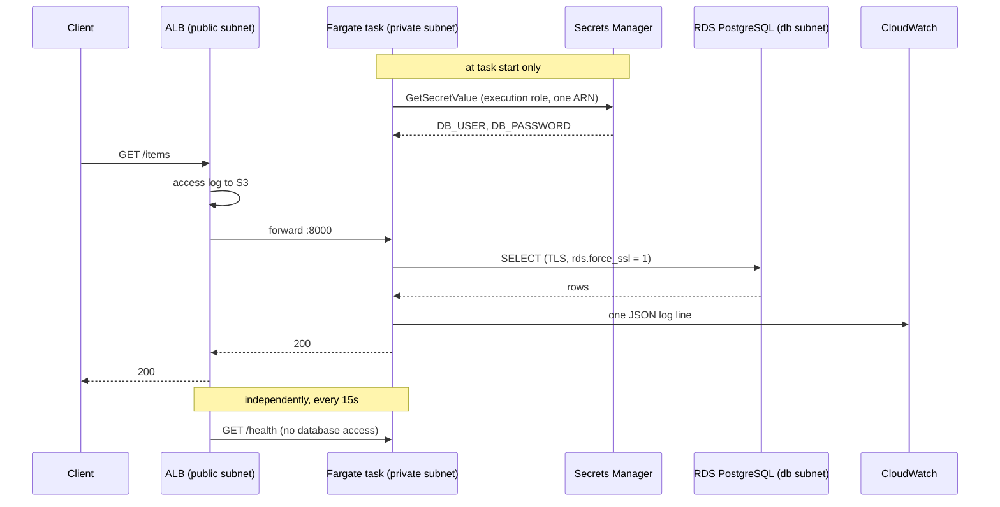
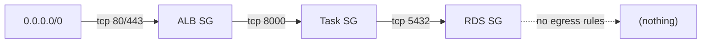
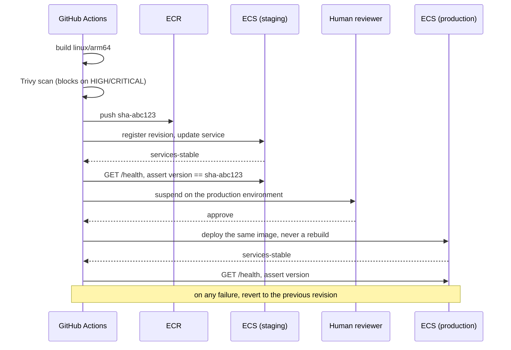

# Architecture

## Request path

`/health` deliberately does not touch the database. If it did, a brief RDS
failover would fail every target at once and pull the whole service out of the
load balancer for a problem the application could have ridden out.

## Security group chain

Every rule after the first references a **security group**, never a CIDR. A CIDR
rule stays correct only while nobody else uses that subnet; a group reference
means "whatever is running the application", which survives every deploy, scale
event and subnet change.

The RDS security group has no egress rules at all. The database subnets also
have no route to the internet, so this is the second of two independent controls
saying the same thing.

## Network layout

| Tier | CIDR (staging) | Route to internet | Contains |
|---|---|---|---|
| Public | `10.20.0.0/20`, `10.20.16.0/20` | IGW | ALB, NAT gateway |
| Private | `10.20.64.0/20`, `10.20.80.0/20` | via NAT | ECS tasks |
| Database | `10.20.128.0/20`, `10.20.144.0/20` | none | RDS |

Production uses `10.30.0.0/16` with the same shape, so the two VPCs can be
peered later without renumbering.

## Deployment sequence

Two properties worth naming:

- **The image is built once.** Production deploys the exact artifact staging ran.
  A rebuild is a different artifact however identical the inputs look.
- **The verification is not "the rollout finished".** It is "the endpoint reports
  the commit SHA we just shipped". Those are different claims, and only the
  second one means the new code is serving traffic.

## Trade-offs taken

| Decision | Gained | Given up |
|---|---|---|
| Fargate over EKS | No nodes to patch, per-task billing, free rollback | Sidecars, scheduling control, price at high sustained load |
| Single NAT in staging | ~32 USD/mo per AZ | Egress survives an AZ failure |
| Spot for all of staging | ~70% of compute cost | Tasks can be reclaimed at two minutes' notice |
| `create_all()` over Alembic | No migration tooling for a demo | Safe schema evolution -- first item on the roadmap |
| REJECT-only flow logs | Most of the flow log bill | Full connection forensics |
| Community Terraform modules | Thousands of lines not written or maintained | A dependency that must be version-pinned and reviewed |
| Terraform ignores `task_definition` | Pipeline and IaC stop fighting | `terraform plan` no longer shows the running image |

## Related documents

- [Architecture decision records](adr/) -- why each of these choices was made
- [Recovery runbook](runbooks/recovery.md) -- what to do when one of them fails
- [Engineering log](engineering-log.md) -- problems hit while building this
